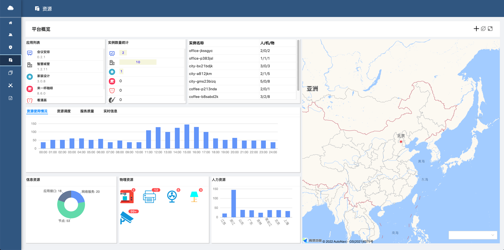

# UDO Application

这是UDO(Universal Digital Object)资源管理平台的后端部分实现，负责UDO模型及实例的管理，以及支撑UDO之间的协同交互过程。

web前端部分：https://github.com/nemoworks/udo-board 

IOS端：https://github.com/nemoworks/udo-iosapp

系统演示：https://www.bilibili.com/video/BV1yq4y1H7wx?share_source=copy_web

详情见[架构说明](docs/架构说明.md)和[部署说明](docs/部署说明.md)。

## 演示示例

