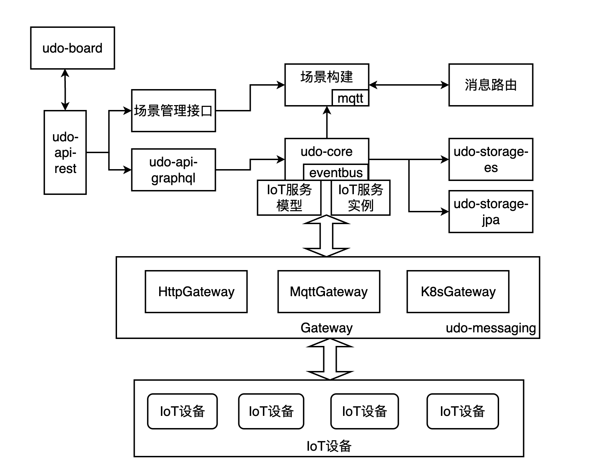

##项目架构


+ udo-message模块实现了各种类型的消息通信网关，负责同步udo中IoT服务与IoT设备的数据。
+ udo-core中定义了IoT服务模型和实例。
+ udo-storage-es是数据管理模块，负责与elasticsearch连接，并实现数据存储。
+ udo-storage-jpa是数据管理模块，负责与mysql连接，实现数据存储。
+ udo-api-graphql是接口生成模块，为IoT服务生成管理接口。
+ udo-api-rest是接口访问层，负责与前端交互。
+ udo-board是web前端。

##项目特点
+ 统一组织管理IoT服务的类型模型，基于类型模型连接注册IoT服务实例，并维护类型的实例数据。
+ 为IoT服务生成标准统一的管理接口，并基于GraphQL构建了DOQL。
+ 提供HttpServiceGateway,MqttGateway等消息通信网关，与IoT服务进行交互和数据同步。
+ 提供IoT服务场景，实现IoT服务之间基于时空属性的服务组合。
+ Udo-board可视化界面。

##模块结构

```
.
├── README.md
├── pom.xml
├── mosquitto-deploy              部署mqtt server
 ├── manifests.yaml
│   └── mosquitto
├── udo-api-graphql               graphql api生成udo管理接口
|
├── udo-api-rest                  restful api支持udo交互,项目接口层
|
├── udo-core                      udo模型定义
|
├── udo-messaging                 udo协同通讯模块
|
├── udo-poc                       udo验证实例
|
├── udo-storage-elasticsearch     udo elasticsearch存储支持
|
└── udo-storage-jpa               udo jpa存储支持

```

