## 演示示例部署说明
为了演示udo项目的实际运行情况，我们借助`homeassistant`平台在udo中注册空气净化器服务。

### 净化器部署

+ 部署`homeassistant`
根据我们实际部署经验，homeassitant镜像版本会影响净化器连接，所以我们选择版本`0.117.5`。
  
```shell
 //拉取镜像
 docker pull homeassistant/home-assistant:0.117.5

 //启动容器
 docker run -d --name="home-assistants" -v /[你的本地存放该容器配置路径]:/config -p 8123:8123 
 homeassistant/home-assistant:0.117.5
 
 //访问homeassistant 
 浏览器访问localhost:8123, 注册登录
```

+ `homeassistant`连接小米空气净化器
  
    + 获取净化器(小米空气净化器v2)的ip和token，homeassistant需要这两项参数。
      
      根据[官方文档](https://www.home-assistant.io/integrations/xiaomi_miio/#retrieving-the-access-token) ,首先需要在安卓手机上安装米家，
      然后在米家中连接空气净化器，然后在log文件中获取净化器的局域网ip和token。
      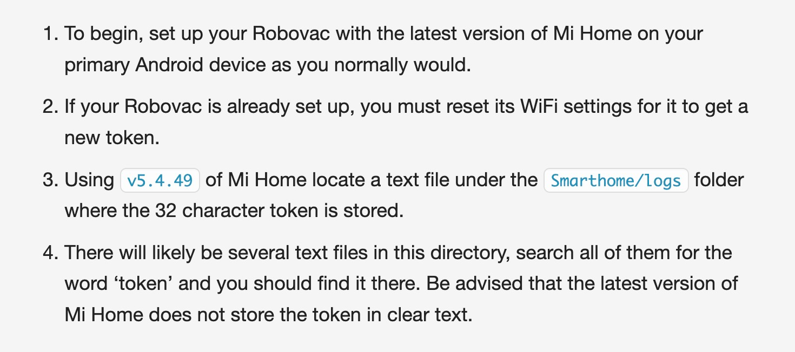
      
      ```shell
        //安装v5.4.49的米家(推荐使用小米手机,亲测其他品牌的安卓机会有适配问题)
         链接: https://pan.baidu.com/s/1TAmwELQTkVJ6RtdsBwa4nQ?pwd=8fv4  提取码: 8fv4
      
        //按照官方教程在米家中连接空气净化器
      
        //在手机的Smarthome/logs目录中找到log文件,获取ip和token,如下图所示
      ```
      log文件所在目录：
      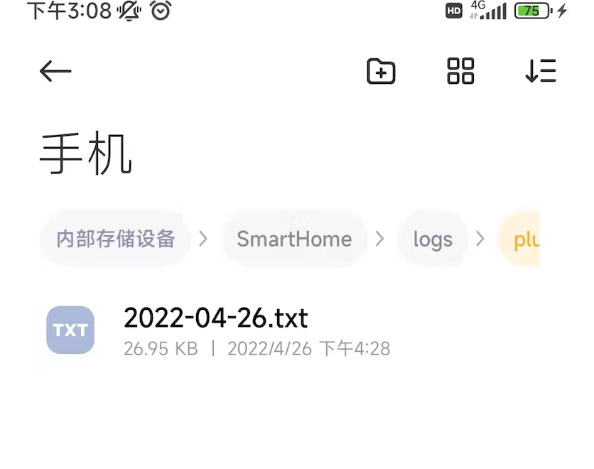
      log文件中的ip和token：
      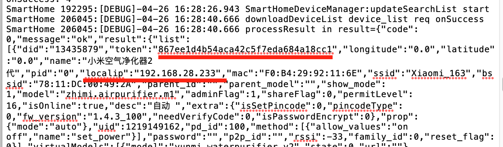
      
    + 部署到`homeassistant`
      ```shell
        //进入容器内部
         docker exec -it home-assistants /bin/bash
        
        //修改configuration.yaml文件,添加净化器服务的ip和host
         vi configuration.yaml
        //添加如下的配置文件
         fan:
          - platform: xiaomi_miio
            name: mypurifier2 
            host: 192.168.28.233 (your ip)
            token: 867ee1d4b54aca42c5f7eda684a18cc1(your token)
      
        //重启容器
         docker restart #your container id#
      
        //刷新homeassistant web页面,可以看到如下页面
      ```
      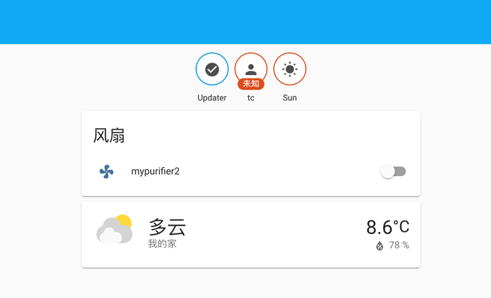
  至此，我们成功将空气净化器服务注册到homeassistant平台上，
      接下来我们将利用homeassistant提供的接口，将空气净化器服务注册到udo平台上。
### udo部署
+ 配置homeassistant平台的auth token和ip地址
    + 为homeassistant配置公网地址
      因为homeassistant与空气净化器需要在局域网中连接，而udo平台在服务器中运行，
      所以为了在服务器中能够访问到homeassistant，需要为homeassistant配置一个公网地址。
    + 根据[官方文档](https://developers.home-assistant.io/docs/api/rest/) ,需要获取
      homeassistant的长期访问令牌，该令牌在(用户/长期访问令牌)中创建。
      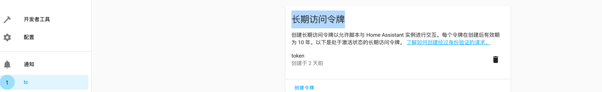
    + 将token和ip地址填入(udo-application/udo-api-rest/Dockerfile)中
      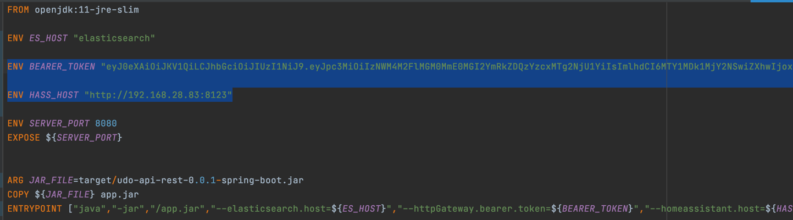
   至此，我们成功获取了homeassistant平台的token和ip地址，并将相关信息填入了Dockerfile中。
      为了测试是否可以访问，可以在postman 中访问<http://#yourip#:8123/api/states/fan.mypurifier2>查看净化器信息。
      接下来我们需要启动并运行udo。   
+ 运行udo
    + 进入udo-api-rest目录，构造udo镜像。
      ```shell
        //删除docker中已有的udo镜像,重新构建
        docker build -t udo .
      ```
    + 回到udo-application目录；启动udo
      ```shell
         //删除已有的容器
         docker-compose down
         //重新部署
         docker-compose up
      ```
    + 访问udo-board，看到udo web页面
    ```shell
       http://47.94.101.110:8080/index.html#/device
    ```
    至此udo部署成功，接下来需要将空气净化器服务注册到udo上
+ 注册空气净化器服务
    + 在资源页面，点击右上角+号
      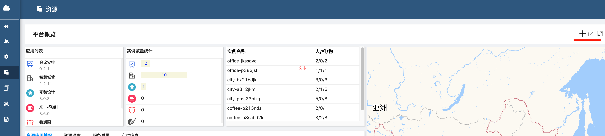
    + 填入空气净化器信息
      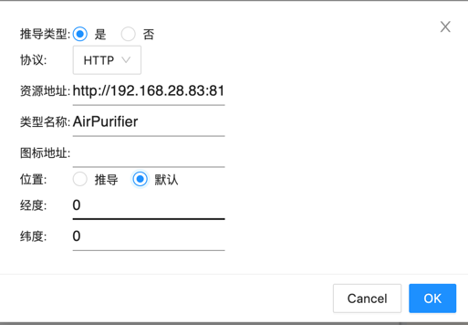
      
      资源地址：http://#yourip#:8123/api/states/fan.mypurifier2
      
      类型名称：Airpurifier
    + 访问类型页面，可以看到udo已经注册了一个Airpurifier类型，点击edit图标，
      可以获取类型的udoi（Sk0mb4ABVZUSjUDXWg9K)
      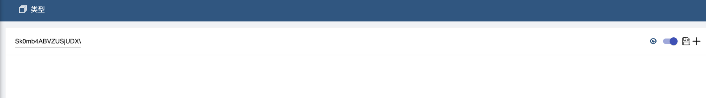
      
    + 查询空气净化器的udoi
      打开DOQL页面，位置如图：
      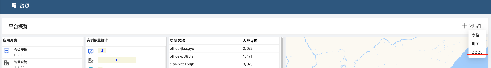
      获取空气净化器服务的udoi,填入如下查询脚本
    ```shell
       {
            AirpurifierDocuments(
                udoTypeId : "Sk0mb4ABVZUSjUDXWg9K"
            ){
                udoi
                state
            }
       }
    ```
    获取到空气净化器的udoi：
    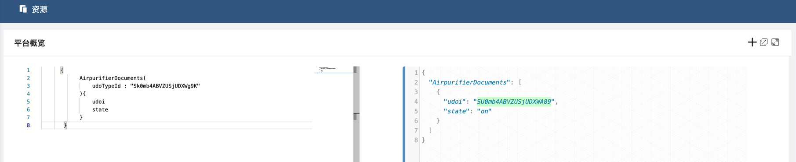
  
   最后操纵净化器服务，填入如下脚本关闭净化器：
    ```shell
    {
       updateAirpurifier(
          udoi : "SU0mb4ABVZUSjUDXWA89"
          content:{
              entity_id : "fan.mypurifier2"
              state : "off"
         }
       ){
           udoi
           state
       }
    }
    ```